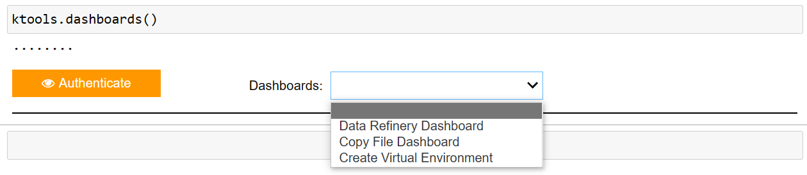

Note: This will not function properly on other systems as it was created for HSBC systems. In addition the code was converted from jupyter notebook to .py, hence the odd format/structure at certain places. The aim is to unify this process to enable it to work on all systems following exposure to other banks.

<div align="center">

# KTools
###### Jupyter notebook dashboard for Data Analysts/Scientist



</div>

## Introduction
Say goodbye to copy pasting "boiler plate" codes, constant change of asset(s) location, and difficulties taken over work from other colleagues.
I present you KTools. KTools was designed to tackle the frustration of data analysts having to resort to multiple sources to enable commencement of their work.

In KTools you can easily 
>	authenticate to enable a sparksession

>	analyse,view and load refinery parquet files

>	view/copy files on the cluster including notebooks by other users

>	create a virtual environment


## 🛠️ Installation
Open a notebook and execute the following command
```env
pip3.8 install /home/jupyterhub/45229799/ktools-1.0.1.tar.gz
```
<details>
<summary><strong>Alternative (Click to expand)</strong></summary>

- Download the file (/dist/ktools-1.0.1.tar.gz) to a location of choice
- Then execute the following command in terminal or Jupyter notebook 
```shell
pip3.8 install [location_of_file]/ktools-1.0.1.tar.gz
```

>replace '[location_of_file]' with the actual location of file. 

>For Jupyter notebooks, prepend the command with '!'

</details>


## 🏃‍♂ Run
To avail the dashboards, run the following command:
```shell
# import ktools
from ktools import ktools
# start dashboard
ktools.dashboards()
```


## 🖥️ Usage
The following dashboards are available under 'ktools.dashboards()':
-	Authenticate : Authenticate using kinit to enable a sparksession
-	Date Refinery Dashboard: Find MDA's, GDA's and CDA's (Coming soon) generated on the cluster using refinery api. In addition the asset's can be analysed using pyspark_dataprofiling (Thanks to *****)
-	Copy File Dashboard: View and/or copy files using a staffID
-	Create Virtual Environment: Enables creation of virtual environment


In addition the following commands can be used to get the latest parquet file.
```shell
ktools.get_latest_parquet("parquet_name")
```
>substitute "parquet_name" with the relevant asset name.


## 🙋 Support
Need help? Want to share a perspective? Report a bug? Ideas for collaborations? Reach out via the following channels:


## 🤝🏽 Contributing
